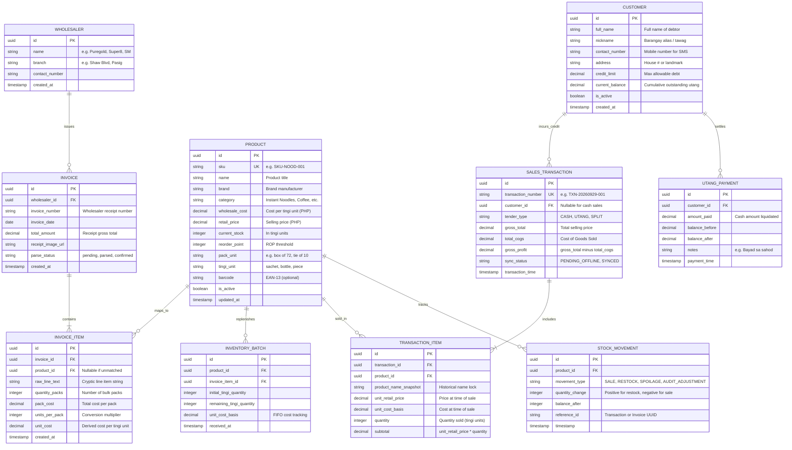

# Entity Relationship Diagram (ERD) & Data Architecture
## TindAI: An AI-Powered Inventory, Sales Logging, and Restocking System

**Course**: CCSFEN1L - Introduction to Software Engineering
**Section**: COM245 | **Group**: GrouPals
**Faculty Evaluator**: Ms. Elsie V. Isip
**Author**: Sapla, Elaijah Angelo A. & GrouPals
**Version**: 1.0.0
**Date**: September 29, 2026

---

## 1. System Conceptual Data Model

The TindAI database architecture models the micro-economic realities of Philippine sari-sari store operations:
1. **Catalog & Dual-Unit Inventory**: Products are purchased in wholesale bulk packs (`pack_unit`) but portion-retailed in single servings (`tingi_unit`).
2. **Sales & Flexible Tender**: Every counter transaction links to itemized lines, supporting instant Cash settlement or attribution to a Customer Utang ledger.
3. **Wholesaler Invoices & Cost Tracking**: Invoices record procurement from wholesale grocers (e.g., Puregold), preserving batch costs to dynamically calculate true margins.
4. **Utang Ledger & Audit Integrity**: Debtor accounts track balance changes and repayment streams without destructive updates.

---

## 2. Mermaid Entity Relationship Diagram

---

## 3. Core Entity Specifications & Schema Dictionary

### 3.1 `PRODUCT` (Catalog Master)
- **Role**: Master dictionary of all FMCG and unbarcoded goods retailed by the store.
- **Key Fields**:
 - `sku`: Unique machine-readable identifier (e.g., `SKU-NOOD-001`).
 - `wholesale_cost`: Unit cost base in PHP, updated dynamically when wholesale receipts are ingested.
 - `retail_price`: Selling price in PHP, defaulting to $15\%$ gross profit markup.
 - `current_stock`: Live counter of remaining portion servings (`tingi_unit`).
 - `reorder_point`: Computed threshold trigger for restocking notifications.

### 3.2 `WHOLESALER` & `INVOICE` (Procurement & OCR Records)
- **Role**: Archives supplier information and stores scanned wholesale paper receipts.
- **Integrity**: `INVOICE.wholesaler_id` links to the vendor. If an invoice line item cannot be matched to an existing catalog SKU, `INVOICE_ITEM.product_id` is set to `NULL` until the store owner onboards the new item.

### 3.3 `INVENTORY_BATCH` & `STOCK_MOVEMENT` (Stock Tracking & FIFO Costing)
- **Role**: Provides an immutable ledger of every stock ingress and egress.
- **FIFO Profit Margin Precision**: When sales occur, COGS is calculated against the active batch unit cost basis, ensuring true gross margin accuracy even across supplier price fluctuations.

### 3.4 `SALES_TRANSACTION` & `TRANSACTION_ITEM` (POS Transactions)
- **Role**: Captures all checkout events initiated from the mobile Fast Review screen.
- **Offline Resilience**: Transactions created while offline receive `sync_status = 'PENDING_OFFLINE'` with client-generated UUIDs. Upon reconnect, they are persisted without collision.
- **Tender Segmentation**: If `tender_type = 'CASH'`, `customer_id` is null. If `tender_type = 'UTANG'`, `customer_id` points to the customer profile.

### 3.5 `CUSTOMER` & `UTANG_PAYMENT` (Digital Credit Ledger)
- **Role**: Implements the informal credit ledger (*listahan ng utang*).
- **Integrity Guarantee**: `CUSTOMER.current_balance` is updated atomically inside a database transaction whenever a credit sale is finalized or an `UTANG_PAYMENT` is logged.

---

## 4. Database Indexing & Performance Strategy

To satisfy **NFR-01** (local response times $\le 200\text{ms}$):
1. **B-Tree Indexes**:
 - `PRODUCT(sku)`: Instant lookup during VLM schema mapping.
 - `PRODUCT(category)`: Fast grouping for catalog views.
 - `SALES_TRANSACTION(transaction_time)`: Real-time daily analytics aggregation.
 - `CUSTOMER(current_balance)`: Instant sorting of highest outstanding balances.
2. **Trigram / GIN Indexing**:
 - `PRODUCT USING gin(name gin_trgm_ops)`: Enables sub-millisecond fuzzy matching against cryptic supermarket receipt OCR line items.
