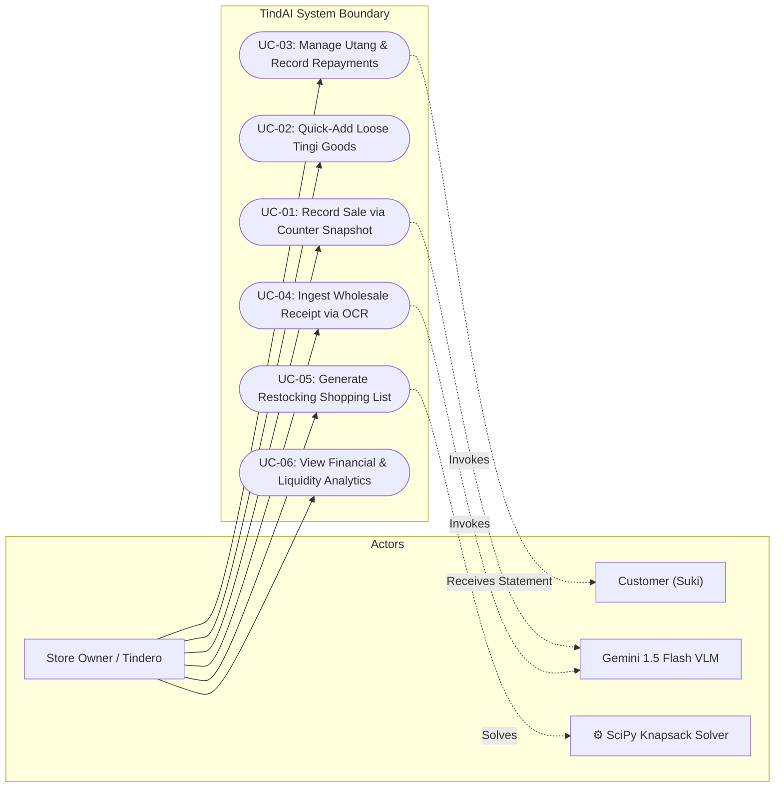

# System Use Case Specifications
## TindAI: An AI-Powered Inventory, Sales Logging, and Restocking System

**Course**: CCSFEN1L - Introduction to Software Engineering
**Section**: COM245 | **Group**: GrouPals
**Faculty Evaluator**: Ms. Elsie V. Isip
**Author**: Sapla, Elaijah Angelo A. & GrouPals
**Version**: 1.0.0
**Date**: September 29, 2026

---

## 1. System Boundary & Use Case Diagram

---

## 2. Detailed Use Case Specifications

---

### Use Case: UC-01: Record Sale via Counter Snapshot
- **Primary Actor**: Store Owner (Tindero / Tindera)
- **Supporting Actor**: Google Gemini 1.5 Flash API
- **Related Requirements**: `FR-01`, `NFR-01`, `NFR-02`, `NFR-04`
- **Preconditions**:
 1. The TindAI Progressive Web App is active on the smartphone.
 2. The mobile camera permission is granted.
 3. Product catalog is populated with store SKUs.
- **Trigger**: Store owner places customer merchandise on the store counter and taps the camera shutter button.

#### Main Success Scenario (Happy Path):
1. The store owner aims the smartphone camera at items on the counter and taps the shutter button.
2. The client application captures the frame, downscales it to $\le 1024 \times 1024$ pixels, applies 80% JPEG compression, and sends it to the backend perception endpoint.
3. The backend forwards the payload to Google Gemini 1.5 Flash with a structured JSON schema instruction.
4. Gemini Flash identifies the visible FMCG items and their respective counts within 3.5 seconds.
5. The system populates the "Fast Review" cart interface displaying the recognized items, individual retail prices, and calculated subtotal.
6. The store owner performs a quick visual check and taps **"Bayad Cash"**.
7. The system records the sales transaction, updates cash-on-hand, decrements physical stock for each item, and displays a momentary confirmation banner with subtle tactile vibration.

#### Alternative Flows:
- **Alt Flow 1a (Credit / Utang Sale)**:
 - At Step 6, the store owner taps **"Utang"** instead of "Bayad Cash".
 - The system displays a search modal with frequent *suki* customer profiles.
 - The owner taps the customer name (e.g., "Nanay Tessie") and taps **"Kumpirmahin ang Utang"**.
 - The system logs the sale, charges the subtotal to the customer's ledger, decrements stock, and leaves cash drawer balance untouched.
- **Alt Flow 1b (Quantity Correction)**:
 - At Step 5, the store owner notices the VLM detected 2 sachets of coffee instead of 3.
 - The owner taps the `+` button on the coffee line item.
 - The subtotal updates dynamically within 50ms before finalizing checkout.

#### Exception Flows:
- **Exception 1c (Network Dropout / Offline Checkout)**:
 - If the device is offline when the photo is taken, the system alerts the user and opens the manual Quick-Add drawer.
 - The sale is finalized locally and queued into IndexedDB for automatic background synchronization upon network reconnection.
- **Exception 1d (Unidentifiable / Blank Image)**:
 - If the VLM detects zero items, the system displays: *"Walang paninda na nakita. Subukang itapat ulit o mag-add gamit ang Quick Add."* The user can either retake or add manually.

- **Postconditions**: Sales transaction is permanently committed to database or offline outbox queue; inventory stock levels are accurately decremented.

---

### Use Case: UC-02: Quick-Add Loose Tingi Goods
- **Primary Actor**: Store Owner (Tindero / Tindera)
- **Related Requirements**: `FR-01.4`
- **Preconditions**: Fast Review POS screen is displayed.
- **Trigger**: Customer purchases unbarcoded or unpackaged goods (e.g., loose fresh eggs, ice water, plastic-repacked sugar, single cigarette sticks).

#### Main Success Scenario:
1. The store owner opens the "Quick Add" bottom drawer on the POS screen.
2. The system displays large, thumb-friendly buttons for top unbarcoded items.
3. The owner taps the desired item (e.g., "Fresh Egg") twice.
4. The system appends 2x Fresh Egg (@ ₱9.50 each) to the active cart, recalculating subtotal by +₱19.00.
5. The owner proceeds to tap "Bayad Cash" or "Utang".

#### Postconditions: Loose items are appended to cart subtotal and decremented from unbarcoded inventory pools.

---

### Use Case: UC-03: Manage Utang & Record Repayments
- **Primary Actor**: Store Owner (Tindero / Tindera)
- **Secondary Actor**: Debtor Customer (Suki)
- **Related Requirements**: `FR-03`
- **Preconditions**: Customer has an existing debtor profile with an active credit balance.
- **Trigger**: Customer arrives at store to settle part or all of their outstanding debt balance.

#### Main Success Scenario:
1. Store owner navigates to the "Utang Ledger" tab.
2. The owner searches or selects the customer's profile (e.g., "Aling Nena").
3. The system displays the customer's total outstanding balance, credit limit, and full chronological transaction history.
4. The owner taps **"Magbayad"** and enters the cash payment amount (e.g., ₱300.00).
5. The owner taps **"I-record ang Bayad"**.
6. The system decrements the customer's outstanding balance, increments physical cash-on-hand, logs an immutable repayment audit entry, and displays the updated balance.

#### Alternative Flows:
- **Alt Flow 3a (Dispatching Courtesy Reminder Statement)**:
 - The store owner taps **"Magpadala ng Reminder"**.
 - The system renders a polite Taglish summary: *"Magandang araw po Aling Nena! Paalala lang po mula kay Ate Lorna Sari-Sari Store ukol sa inyong balance na ₱350.00. Salamat po!"*
 - The owner taps **"I-share sa Messenger / SMS"**, invoking the native device share sheet.

#### Exception Flows:
- **Exception 3b (Repayment Exceeds Balance or is Negative)**:
 - If entered payment is $\le 0$ or exceeds outstanding balance, the system alerts the owner and prevents submission.

- **Postconditions**: Debtor balance is updated in real time; cash inflow is synchronized with daily ledger.

---

### Use Case: UC-04: Ingest Wholesale Grocery Receipt via OCR
- **Primary Actor**: Store Owner (Tindero / Tindera)
- **Supporting Actor**: Google Gemini 1.5 Flash API
- **Related Requirements**: `FR-02`
- **Preconditions**: Store owner has a physical printed invoice from a wholesale trip (e.g., Puregold).
- **Trigger**: Store owner returns from wholesaler and opens the "Scan Receipt" screen.

#### Main Success Scenario:
1. The store owner captures or uploads a high-resolution photo of the supermarket receipt.
2. The system transmits the receipt image to the backend OCR parser service.
3. The parser extracts line items, wholesale pack quantities, pack wholesale costs, and overall invoice total.
4. The system matches raw lines against internal catalog SKUs using fuzzy string matching.
5. The system presents a parsed review screen highlighting matched SKUs, computed unit tingi wholesale costs, and default 15% retail selling prices.
6. The owner reviews the list and taps **"Kumpirmahin ang Stock-In"**.
7. The system creates a new batch entry, updates current inventory stock numbers, and adjusts cost bases.

#### Alternative Flows:
- **Alt Flow 4a (Unmatched Item Onboarding)**:
 - If a receipt line cannot be matched to an existing catalog SKU, the system flags it with a yellow tag: *"Bagong Item"*.
 - The owner confirms the proposed item name and retail price, immediately creating a new catalog SKU.

- **Postconditions**: Inventory quantities are replenished; cost-of-goods references are updated.

---

### Use Case: UC-05: Generate Restocking Shopping List (Knapsack Optimizer)
- **Primary Actor**: Store Owner (Tindero / Tindera)
- **Supporting Actor**: SciPy / PuLP Knapsack Solver
- **Related Requirements**: `FR-04`
- **Preconditions**: Store catalog has current stock levels and historical sales velocities.
- **Trigger**: Store owner plans a restocking trip and inputs their available revolving cash budget.

#### Main Success Scenario:
1. The store owner opens the "Restocking Optimizer" module.
2. The owner inputs their available cash budget (e.g., `₱5,000.00`) and taps **"I-optimize ang Listahan"**.
3. The backend calculates dynamic Reorder Points ($ROP$) for all SKUs and executes the Bounded Knapsack Optimization algorithm.
4. The algorithm selects the exact combination of wholesale packs that maximizes expected profit yield without exceeding ₱5,000.00.
5. The system displays the prioritized shopping checklist, organized into supermarket aisle categories (e.g., Canned Goods, Noodles, Beverages, Condiments).
6. The owner reviews the list and taps **"I-export / I-print"** or saves it to their phone for the shopping trip.

#### Alternative Flows:
- **Alt Flow 5a (Manual Override of Quantity)**:
 - The owner overrides a recommended pack count; the system updates remaining budget headroom in real time.

- **Postconditions**: Optimized purchase order checklist generated with zero budget overrun.

---

### Use Case: UC-06: View Financial & Liquidity Analytics
- **Primary Actor**: Store Owner (Tindero / Tindera)
- **Related Requirements**: `FR-05`
- **Preconditions**: Store has logged sales and expense records.
- **Trigger**: Store owner opens the Analytics tab to assess business health.

#### Main Success Scenario:
1. Store owner selects the reporting interval (Today, Last 7 Days, Month-to-Date).
2. The system renders graphical charts and key performance indicators:
 - Gross Revenue (₱)
 - Cost of Goods Sold - COGS (₱)
 - Net Gross Profit (₱)
 - Liquidity Breakdown: Physical Cash-on-Hand vs. Uncollected Customer Utang.
3. The owner assesses whether sufficient cash exists for household drawdowns without dipping into inventory revolving capital.

- **Postconditions**: Owner gains transparent financial visibility without commingling business and personal funds.
